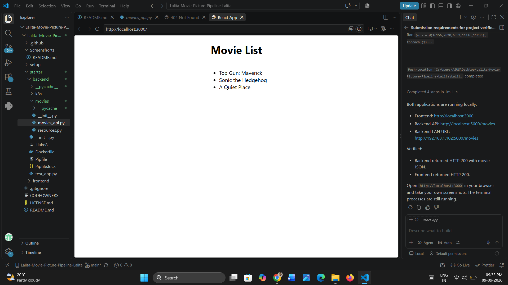
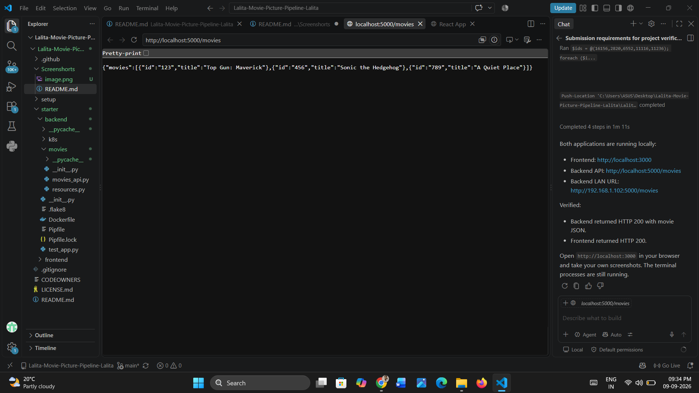
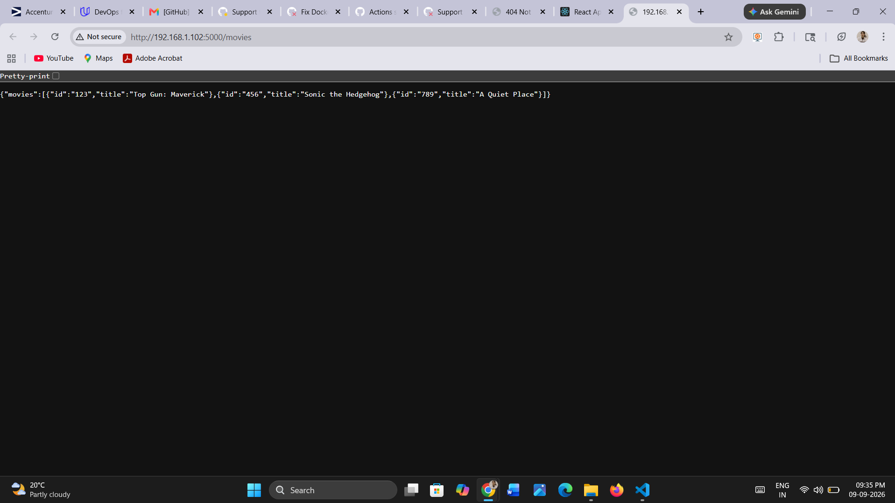

# Project Verification Screenshots

This folder contains the project's local application checks and GitHub Actions CI/CD captures.

## Local application checks

### Frontend

The React frontend was verified at `http://localhost:3000` and displayed the movie list returned by the backend.

### Backend API

The Flask API was verified at `http://localhost:5000/movies`.

The API was also checked from the local network at `http://192.168.1.102:5000/movies`.

## GitHub Actions pipeline checks

### Backend CD

### Backend CI

### Frontend CI

### Frontend CD

## Final AWS evidence

For the final submission, add sequential, unedited captures showing:

1. AWS account identity, EKS cluster ARN, ECR repository ARNs, and deployed image references.
2. `kubectl get svc,pods,deploy,nodes -o wide` output.
3. `kubectl describe deploy` and `kubectl describe svc` output.
4. Frontend and backend ECR image tags and digests.
5. Current deployed frontend and backend LoadBalancer URLs.

Every AWS screenshot must show a timestamp and a unique identifier such as the Git commit SHA, AWS account ID, resource ARN, ECR digest, EKS cluster ARN, or LoadBalancer hostname. Do not reuse screenshots from another project or alter the captures.